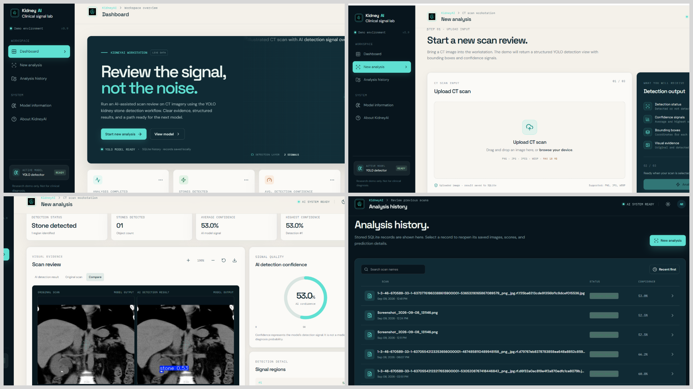
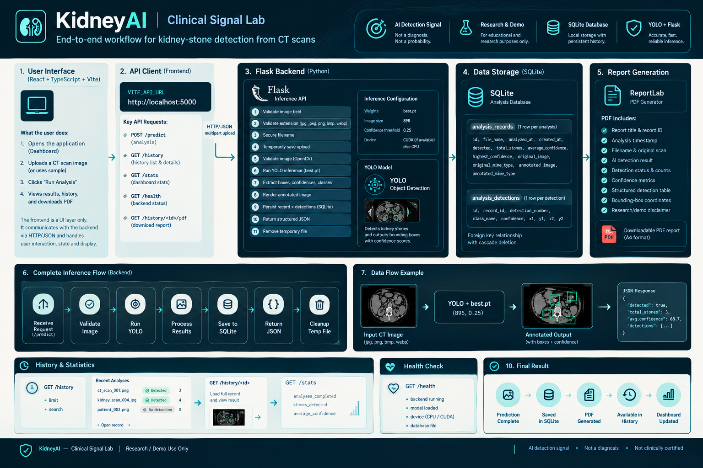

# KidneyAI -- Kidney Stone Detection System

A web-based **AI-assisted kidney stone detection system** built with
**React, TypeScript, Flask, YOLO, OpenCV, SQLite, and ReportLab**. It
allows users to upload CT scan images, detect possible kidney stones,
review results, save analysis history, and download PDF reports.

## FRONTEND


## Workflow



## Overview

-   Upload CT scan images
-   Detect possible kidney stones using YOLO
-   View bounding boxes and confidence scores
-   Save analyses in SQLite
-   Review previous analyses
-   Download PDF reports

## Features

-   **AI Detection** --- YOLO-based kidney stone object detection with
    bounding boxes and confidence scores.
-   **Dashboard** --- Analysis count, stones detected, average
    confidence, recent activity, and system status.
-   **Analysis History** --- Search and reopen saved analysis records.
-   **PDF Reports** --- Download reports containing scan images and
    detection details.
-   **Model Information** --- View active model and detection
    configuration.
-   **Responsive UI** --- Modern medical-AI interface with light/dark
    theme support.
## AI Model

The project uses a custom-trained YOLO26m model for kidney stone detection.

### Training Configuration

- **Model:** YOLO26m
- **Epochs:** 100 maximum
- **Training Completed:** Epoch 82
- **Image Size:** 896 × 896
- **Batch Size:** 8
- **Confidence Threshold:** 0.25
- **Patience:** 20
- **GPU:** CUDA when available, otherwise CPU
- 
## Tech Stack

-   **Frontend:** React, TypeScript, Vite, Tailwind CSS
-   **Backend:** Python, Flask, Flask-CORS
-   **AI:** Ultralytics YOLO26m
-   **Image Processing:** OpenCV, NumPy
-   **Database:** SQLite
-   **Reports:** ReportLab

## Project Structure

``` text
KidneyAI/
├── client/
│   ├── public/
│   └── src/
├── server/
├── shared/
├── patches/
├── package.json
├── pnpm-lock.yaml
├── vite.config.ts
└── tsconfig.json

Backend/
├── app.py
├── best.pt
└── kidneyai.sqlite3
```

## Requirements

### Frontend

-   Node.js
-   pnpm

``` bash
pnpm install
```

### Backend

-   Python 3.10+
-   `best.pt` YOLO model

``` bash
pip install flask flask-cors ultralytics opencv-python numpy torch reportlab
```

## Configuration

Frontend API:

``` text
VITE_API_URL=http://localhost:5000
```

Backend defaults:

-   Image size: `896`
-   Confidence threshold: `0.25`
-   Maximum upload size: `10 MB`
-   CUDA/GPU when available, otherwise CPU

## How to Run

### Backend

``` bash
python app.py
```

Runs on:

``` text
http://localhost:5000
```

### Frontend

``` bash
pnpm dev
```

Open the local Vite URL shown in the terminal.

## Application Flow

``` text
Dashboard
   ↓
New Analysis
   ↓
Upload CT Image
   ↓
POST /predict
   ↓
YOLO Detection
   ↓
Detection Result
   ↓
Save to SQLite
   ↓
Analysis History
   ↓
PDF Report
```

## API

  Endpoint                  Purpose
  ------------------------- ----------------------------
  `GET /health`             Backend/model status
  `POST /predict`           Run kidney stone detection
  `GET /history`            Get saved analyses
  `GET /history/<id>`       Get a specific analysis
  `GET /stats`              Dashboard statistics
  `GET /history/<id>/pdf`   Download PDF report

## Database

SQLite stores analysis time, file name, detection status, stone count,
confidence scores, original/annotated images, and individual detection
coordinates.

## Disclaimer

> KidneyAI is an **AI-assisted research and demonstration system**. It
> is not a substitute for professional medical diagnosis or certified
> clinical interpretation. Detection confidence should not be
> interpreted as a medical diagnosis probability.

## Author

**Anas Waqas**
